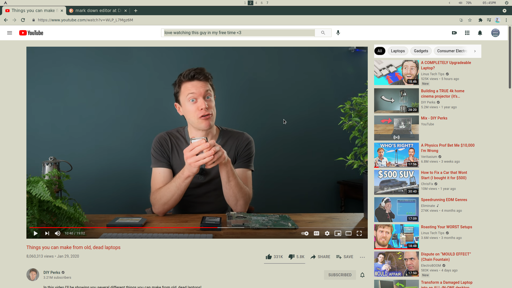
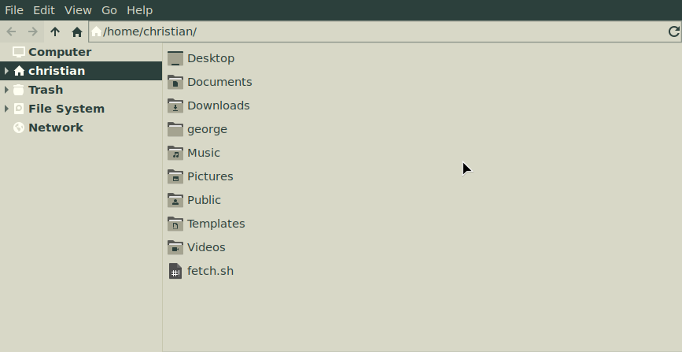
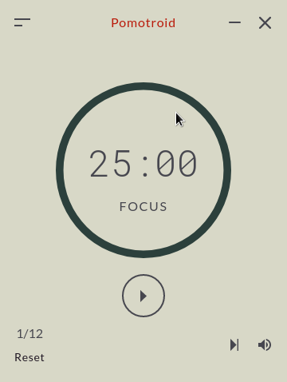

## hi, I'm LetsHaveKiddos and these are my arch linux i3 dotfiles for a cat named George.

I highly recommend using redshift with your theme or using some kind of blue light filter. It's a light theme, protect those eye balls!
i3's borders are somewhat crucial. I'm not sure if other window managers allow for creating borders on the fly but 1 px border with this color #201723 is how I have my i3 conf setup. 

## overview

## NOTES

## I highly recommend using redshift or using some kind of blue light filter. It's a light theme, protect those eye balls!

You may want to change vsync or refresh rate option in picom. I have shadows disabled in this particular rice because it felt more cohesive --kind of pen and paper-esque. Just felt right. Feel free to tinker to your likings however.

I use i3lock & betterlockscreen in place of a logindm. The power menu will call to a betterlockscreen script.

## things I forgot 

## css

## thunar

## pomotroid

