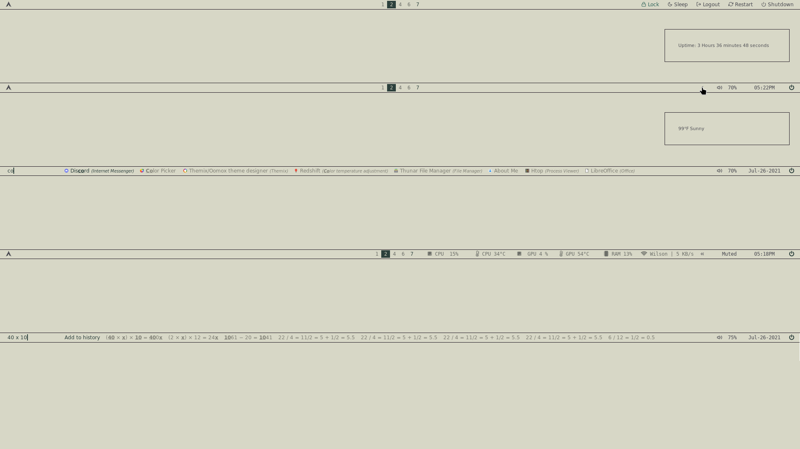
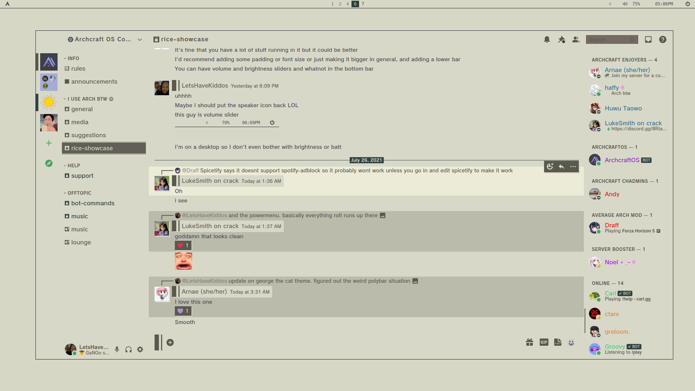

## hi, I'm LetsHaveKiddos and these are my arch linux i3 dotfiles for a cat named George.

## screens

## overview

## polybar

## css

## discord

## nvim ranger neofetch htop

## qutebrowser ungoogled-chromium

## sublime kitty zathura

## sublime kitty

## thunar

## NOTES

You may want to change vsync or refresh rate option in picom. I have shadows disabled in this particular rice because it felt more cohesive --kind of pen and paper-esque. Just felt right. Feel free to tinker to your likings however.

I use i3lock & betterlockscreen in place of a logindm. The power menu will call to a betterlockscreen script.

